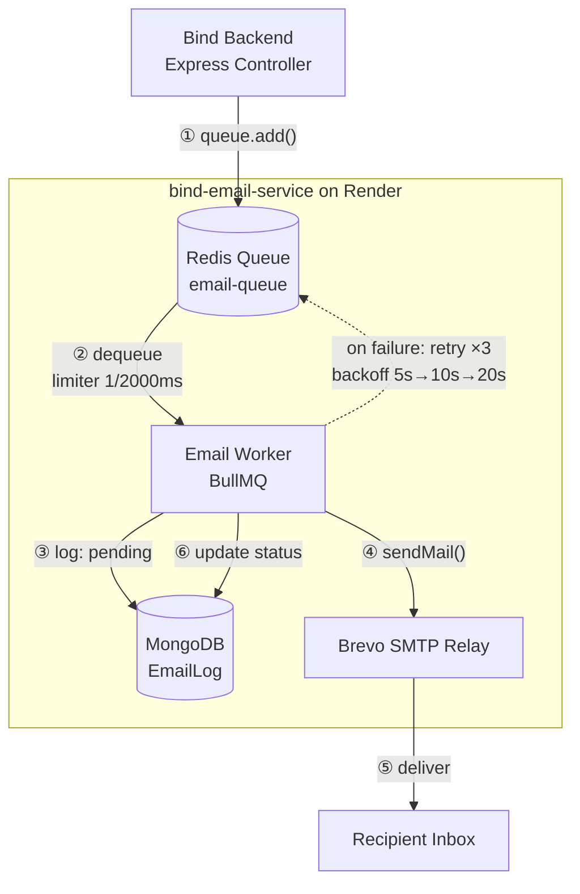

# bind-email-service


A standalone, horizontally-scalable email worker: it consumes jobs from a Redis/BullMQ queue, sends the message over SMTP, and logs the delivery outcome to MongoDB. It was extracted out of [Bind](#how-this-connects-to-bind), a full-stack chat app, so that sending mail could be deployed, scaled, and failed independently of the main API.

## Architecture



The backend never talks to SMTP directly — it drops a job on Redis and returns immediately. The worker is the only process that knows how to send mail, log the attempt, and retry it, so swapping email providers or scaling delivery never touches the request path.

## How this connects to Bind

This repo started life inside Bind's backend and was split out into its own service and its own deployment (`app/` in this repo is the original monorepo, kept only as a reference for how the pieces fit together — it isn't run from here). The split means **Redis is the entire integration surface**: this worker and Bind's backend don't share code, don't call each other over HTTP, and don't need to know about each other's deploy target. As long as both point `REDIS_URL` at the same Redis instance and agree on the job contract below, either side can be redeployed, rewritten, or moved to a different host without touching the other.

### Job contract

Any producer — Bind's backend today, anything else tomorrow — triggers an email by pushing one of these onto the `email-queue` BullMQ queue:

| Job name       | Payload                  | Triggered by (in Bind's backend)                                  |
| -------------- | ------------------------- | ------------------------------------------------------------------ |
| `send-otp`     | `{ email, otp }`           | `user.controllers.js` — login/verification flow                    |
| `send-welcome` | `{ email, name }`          | `user.controllers.js` — right after registration completes         |

Adding a new email type means adding a `case` in [src/workers/emailWorker.js](src/workers/emailWorker.js) plus a template in [src/templates/](src/templates/) — the producer side just needs to agree on a job name and payload shape, nothing else.

Minimal producer example (this is exactly what `app/backend/src/utils/emailQueue.js` does):

```js
import { Queue } from "bullmq";
import { Redis } from "ioredis";

const connection = new Redis(process.env.REDIS_URL, { maxRetriesPerRequest: null });
const emailQueue = new Queue("email-queue", { connection });

await emailQueue.add("send-welcome", { email: "user@example.com", name: "Ada" });
```

## Environment variables

Copy `.env.sample` to `.env` and fill in:

| Variable             | Required | Notes                                                                 |
| --------------------- | -------- | ---------------------------------------------------------------------- |
| `PORT`                | no       | Defaults to `4000`. Only used by the dummy health-check HTTP server.  |
| `REDIS_URL`           | yes      | Must be the **same Redis instance** the producer(s) enqueue to. Use `rediss://` (TLS) for Upstash — plain `redis://` will silently fail to connect. |
| `MONGODB_URI`         | yes      | Used only for the `EmailLog` collection — can be its own database, doesn't need to match Bind's main DB. |
| `SMTP_HOST`           | yes      | e.g. `smtp-relay.brevo.com`. Any SMTP provider works — this project isn't tied to a specific vendor's SDK. |
| `SMTP_PORT`           | yes      | `587` for STARTTLS (the common free-tier default).                    |
| `SMTP_USER`           | yes      | Provider SMTP login.                                                  |
| `SMTP_PASS`           | yes      | Provider SMTP key/password — not your account password.               |
| `EMAIL_FROM_ADDRESS`  | yes      | Must be an address verified with your SMTP provider, or sends are rejected. |

## Running locally

1. `npm install`
2. Copy `.env.sample` to `.env` and fill in the table above.
3. `npm start` — starts the worker, listening for jobs on `email-queue`.
4. In another terminal: `npm run test:send -- you@example.com` — enqueues a real job and drives it through the full pipeline (Redis → BullMQ → worker → SMTP → MongoDB log) without needing Bind's backend running at all.

## Deployment

Deployed as a Render **Web Service**, not a background worker — Render requires an open HTTP port to consider a service healthy, so [src/index.js](src/index.js) binds a trivial HTTP server (`GET /` → 200) purely to satisfy that health check; it serves no real traffic. The actual work happens in the BullMQ `Worker` running in the same process, long-polling Redis.

- Build command: `npm install`
- Start command: `npm start`
- Set every variable from the [environment table](#environment-variables) in Render's dashboard — there is no `.env` file in production.

## Design notes

A few decisions worth knowing about if you're reading this as a reference:

- **Decoupled by queue, not by HTTP.** The backend enqueues and moves on; it never blocks a request on an SMTP round-trip, and this service can be down, redeploying, or completely rewritten without the backend noticing.
- **Rate-limited on purpose.** The worker is capped at 1 job / 2000ms (`emailWorker.js`) so a traffic spike can't blow through a free-tier SMTP provider's daily/per-second limits.
- **Retries are the queue's job, not the worker's.** `attempts: 3` with exponential backoff is configured on the producer side (`defaultJobOptions` in `emailQueue.js`); a thrown error in the worker is enough to trigger it — no manual retry logic here.
- **Every attempt is audited.** `EmailLog` gets a `pending` row before the send is attempted and is updated to `success`/`failed` (with the real error message) after — so a silent crash mid-send still leaves a trace instead of a gap.
- **Provider-agnostic delivery.** `src/config/mailer.js` talks plain SMTP via Nodemailer, not a vendor SDK. Moving off Brevo to Gmail, SMTP2GO, SES, or anything else is an env var change, not a code change.

## Project structure

```
src/
├── index.js              # entrypoint: connects DB/Redis, starts the worker + health-check server
├── setup.js               # forces IPv4 DNS resolution (fixes ENETUNREACH on some hosts)
├── config/
│   ├── db.js               # MongoDB connection
│   ├── redisClient.js       # shared ioredis connection for BullMQ
│   └── mailer.js            # Nodemailer/SMTP transport
├── models/
│   └── emailLog.js          # delivery audit trail schema
├── templates/                # HTML email templates (OTP, welcome)
└── workers/
    └── emailWorker.js         # the BullMQ Worker — job routing, sending, logging

test/
└── sendTestJob.js         # manually enqueues a job to exercise the full pipeline
```
